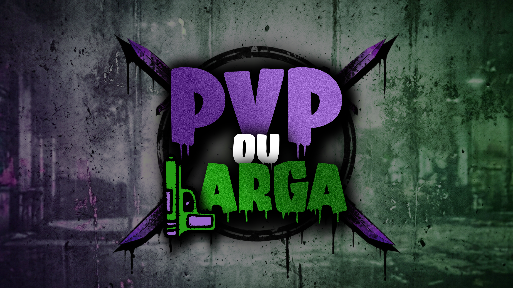

  

  <h1 style="color: #7F35C9;">PVP OU LARGA</h1>
  
<strong>Site oficial do melhor servidor de PVP de FiveM</strong>

  

    <a href="https://pvpoularga.github.io/info/home/">🌐 Visitar o site</a>
    ·
    <a href="https://pvpoularga.github.io/info/rules/">📜 Regras</a>
    ·
    <a href="https://pvpoularga.github.io/info/FAQ/">❓ FAQ</a>
  

---

## Sobre o projeto

Este repositório contém o site oficial da **PVP OU LARGA**, uma comunidade dedicada ao PVP no **FiveM**.

O site foi criado para reunir, num só lugar, as informações essenciais da comunidade e do servidor:

- apresentação da comunidade;
- regras do servidor;
- respostas às perguntas mais frequentes;
- acesso rápido ao Discord;
- ligação para o TikTok oficial;
- Hall of Fame com momentos em destaque.

O **PVP OU LARGA** é uma comunidade de PVP para FiveM.

Antes de entrares no servidor, consulta as [regras oficiais](https://pvpoularga.github.io/info/rules/) e, se precisares de ajuda, visita a [FAQ](https://pvpoularga.github.io/info/FAQ/).

## Comunidade

Queres entrar na comunidade, acompanhar as novidades ou esclarecer alguma dúvida?

---

  O CHICO DA TINA AMA-TE

